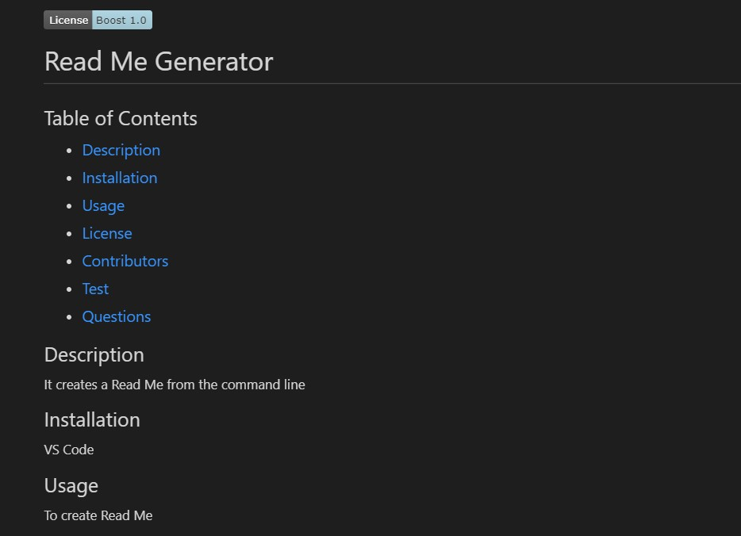

# Challenge 9 - README Generator

## Purpose
To quickly create a README from the command line using Node and Inquirer.

## Built With
* JavaScript
* Inquirer
* JSON
* Node

## Requirements/Notes
* AS A developer
* I WANT a README generator
* SO THAT I can quickly create a professional README for a new project

## Video Link
https://drive.google.com/file/d/1kEQXm3tJqW2iNUYJzsDm78CMiAphOUI1/view
## Github Link
https://christenson10.github.io/challenge9/

## Pictures

## README Preview 1

## README Preview 2

